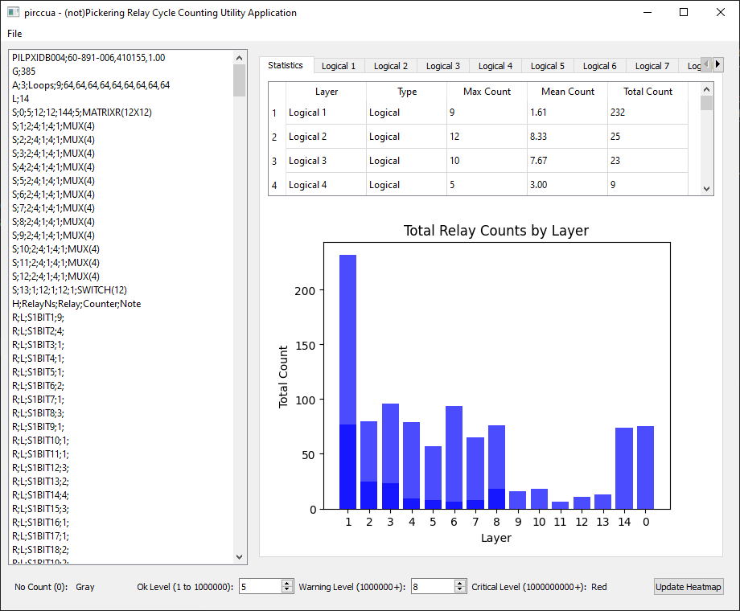
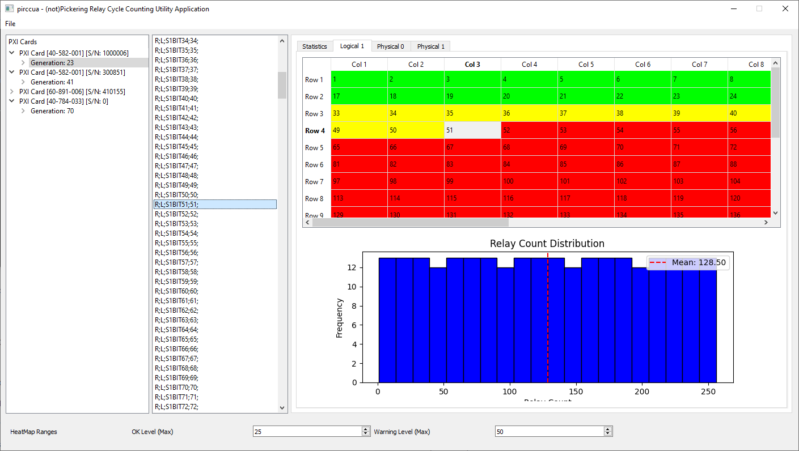

# python (not)pickering's relay cycle counting utility application

This humble project brings you an boring Relay Cycle Counting utility application implemented in python, mostly diffs and statistics between DB files... and because there is a lack of pickering GUI applications under linux...

Description of fileformat specification can be found in the [official reference manual](https://downloads.pickeringtest.info/downloads/RelayCountingApplication/RelayCountingAppHelp.pdf)

## Features

1. Parses RelayCount Card Database File (something like NI PXIe Health Monitor)
2. Shows statistics on pickering PXI card physical or logical layers.
3. Allows user to set count heatmap and have visual feedback reference.
4. Associate txt file with table view

## Screenshots





## Dependencies

**matplotlib**
```
pip install matplotlib
```

**PyQT5**
```
pip install PyQt5
```

## Run
```
python pircviewer.py
```
